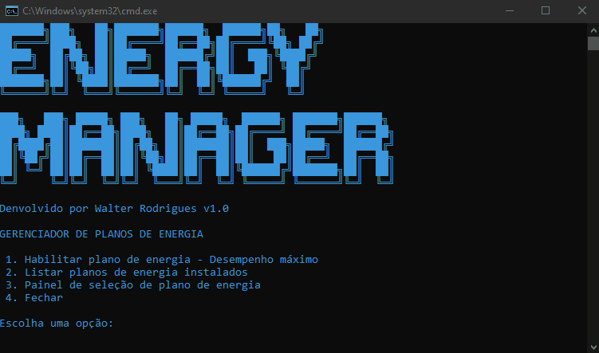
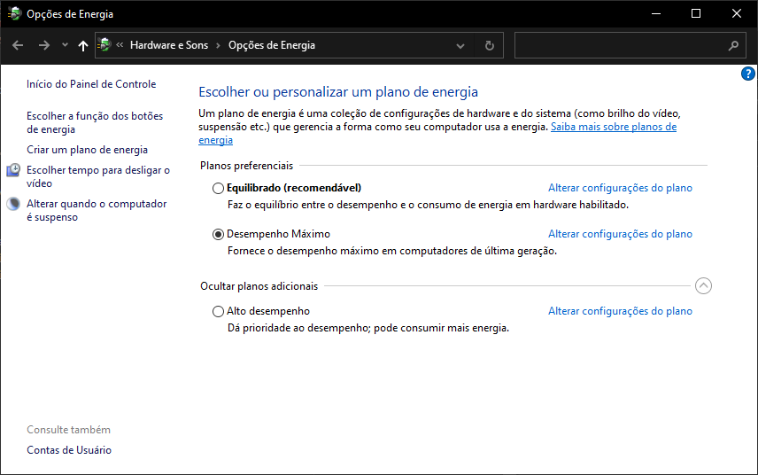
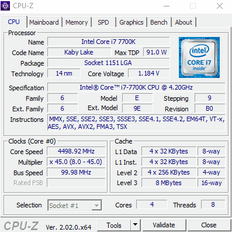

  

<h1 align="center">Energy Manager

  
  
  
  
</h1>

  Um simples gerenciador à moda antiga.

Este projeto foi desenvolvido com o objetivo de facilitar e minimizar o tempo durante a otimização de um computador.</b>

## Funcionalidades
* [x] Ativar plano de energia Desempenho máximo
* [x] Listar planos de energia disponíveis
* [x] Atalho para abrir o painel de planos de energia do windows

## Sistemas suportados
* <code>Windows 10</code>
* <code>Windows 11</code>

## Como utilizar
* Abra o arquivo <code>Energy-manager.bat</code> pressione <kbd>1</kbd> e tecle <kbd>enter</kbd>.
* O painel de seleção vai abrir automaticamente, basta selecionar <b>Desempenho máximo</b>.
* Caso tenha adicionado o plano de forma duplicada e queira excluir, basta usar a opção <kbd>2</kbd>, copiar o código do plano duplicado, abrir uma nova instancia do CMD e usar o comando <code>powercfg.exe /delete código</code>. Exemplo <code>powercfg.exe /delete a14a5c46-3f7c-4621-8400-ca380d72f81a</code>.
* Use a opção <kbd>2</kbd> para listar novamente ou <kbd>3</kbd> para abrir o painel de planos de energia.

## Dicas
* A fim de obter o melhor desempenho do seu computador, principalmente do processador, é indicado que utilize o plano de energia com desempenho máximo.
* O plano de energia modifica a forma que o processador trabalha, sua frequência ficará sempre na máxima permitida, portanto fique atento nas <b>temperaturas</b>. 
* Este procedimento combinado com uma boa configuração na BIOS e em outros parâmetros no windows, faz com que você obtenha 100% do potencial que o seu hardware pode te entregar.

## Exemplo
* Neste caso o processador tem frequência base de 4.2GHz e 4.5GHz com TurboBoost.
* A diferença entre usar um plano de energia "Economia de energia" e o "Desempenho máximo", é que o economico ficará com a frequencia mínima ativada, trabalhando com < 1Ghz e ao abrir um jogo a frequência vai aumentar conforme necessário.
* O problema em não usar o Desempenho máximo é que talvez o jogo não consiga habilitar o TurboBoost e utilizar de fato a frequência maior que o processador consegue trabalhar.

